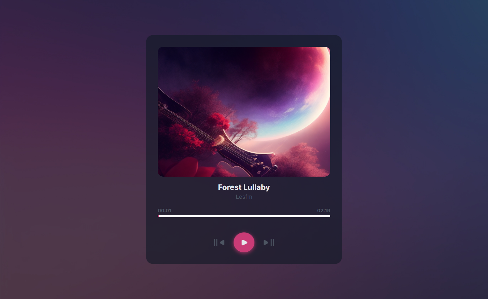
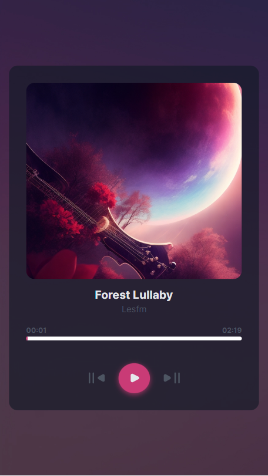

# Dev Challenges - Music Player

This is a solution to the [Music player From challenge on Dev Challenges](https://devchallenges.io/challenge/music-player). Dev challenges help you improve your coding skills by building realistic projects.

## Table of contents

- [Overview](#overview)
  - [The challenge](#the-challenge)
  - [Screenshot](#screenshot)
  - [Links](#links)
- [My process](#my-process)
  - [Built with](#built-with)
  - [What I learned](#what-i-learned)
  - [Continued development](#continued-development)
  - [Useful resources](#useful-resources)
- [Author](#author)

## Overview

### The challenge

Users should be able to:

- View the optimal layout for the site depending on their device's screen size
- See hover states for all interactive elements on the page
- Users should be able to play and stop the current song.
- Users should be able to go to next and previous songs.
- Users should be able to change play time with the progress bar.

### Screenshot

### Links

- Live Site URL: [https://musicplayerdevchallenge.netlify.app/](https://musicplayerdevchallenge.netlify.app/)

## My process

### Built with

- Semantic HTML5 markup
- CSS custom properties
- Flexbox
- Vanilla JS

### What I learned

Audio DOM Api, Making Progress Bar, timeUpdate eventListener

### Continued development

I will continue to focus on improving writing javascript code clean effecient and more maintainable. I will continue learning problem solving skill and make more and more project. I will keep improving in this areas and make websites more interactive.

### Useful resources

- [Google, Stackoverflow](https://www.google.com/) - This helped me for finding usefull methods and getting confidence my ideas.

## Author

- Website - [Sudip khatri](https://sudipkhatri.netlify.app/)
- Dev Challenges - [@SudipKhatri](https://devchallenges.io/profile/668a4472-7c2c-4f92-9b06-80c7ed9577bd)
- Linkedin - [@SudipKhatri](https://www.linkedin.com/in/sudip-khatri-a72a6a27b/)
